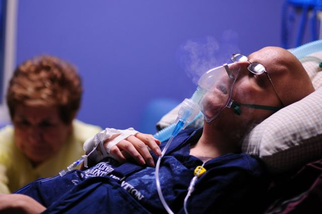
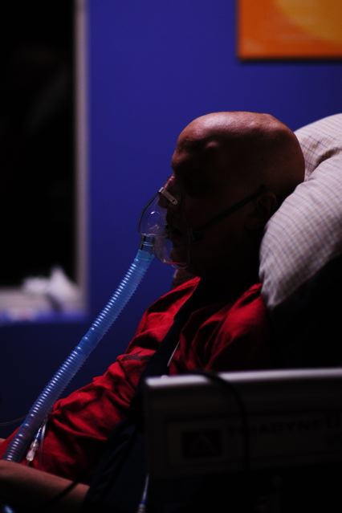
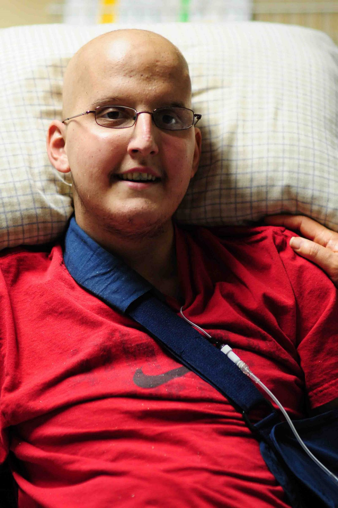

# MyMission
My mission is simple: devote my life toward serving others. For the past few years I've worked closely with post-docs, and although they are among the educated elite, their career is an especially challenging one without any guarantees.  I've decided to devote my life to this difficult lifestyle due my personal experiences with the devastation brought from cancer. 
    My brother was diagnosed with Ewing's Sarcoma cancer at the age of 13, and we lost him at the age of 18 October 24th, 2008.  These experiences shaped my desire to become much more involved in cancer research.  Cheryl Mattingly in her text "The Paradox of Hope" describes very accurately how I felt in her anthropological study of families enduring cancer treatment. She found that it is not uncommon for families who lose kin to cancer to transfrom into activists because their desperate hope for their individual child's recovery broadens into a hope for all ill children.  Many families become involved with fund-raising, etc.  I am devoted to the advancement of cancer treatment; a hope for other struggling families.

